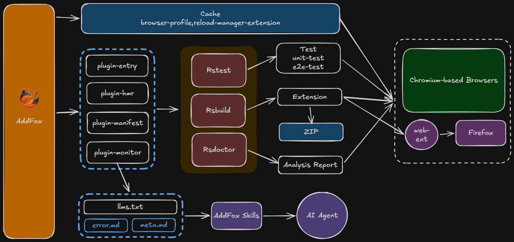

<p align="center">
  
</p>

<h1 align="center">Addfox</h1>
<p align="center">基于 Rsbuild 的浏览器扩展开发框架</p>

<div align="center">
  <a href="https://addfox.dev">官方文档</a> · <a href="https://www.npmjs.com/package/addfox">npm</a> · <a href="https://github.com/addfox/skills">Skills</a>
</div>

---

## 架构

Addfox 基于 Rsbuild（Rspack/Rstack）封装扩展能力；构建产物在 Chrome 或 Firefox 中加载。

<p align="center">
  
</p>

---

## 特点

- 🔥 **急速开发模式与热更新** — `addfox dev` 启动 watch，改代码即重建并热重载扩展；浏览器自动打开并加载构建结果，与生产同一套产物。
- 📦 **自动生成 zip** — `addfox build` 后默认在 `.addfox` 下打出 zip；一条命令同时得到目录和可提交商店的 zip。
- 📁 **基于文件的入口** — 按 `app/` 目录结构自动发现 background、content、popup、options、sidepanel、devtools；需要时在配置中覆盖或增加自定义入口。
- 🌐 **多 Chromium 系浏览器与 Firefox** — 使用 `-b chrome|edge|brave|vivaldi|opera|firefox|...` 指定 Chrome、Edge、Brave、Vivaldi、Opera、Arc、Yandex 或 Firefox；manifest 可按浏览器拆分。
- ⚛️ **框架无关** — 支持 Vue、React、Svelte、Solid 或纯 JS；TypeScript 或 JavaScript；在脚手架中选择或按需添加对应插件。
- 🤖 **AI 友好错误输出** — 开启 `--debug` 即可使用仅开发环境的错误面板：按入口聚合错误，一键 Copy prompt、Ask ChatGPT、Ask Cursor。
- 🧪 **Rstest 支持** — 直接运行 `addfox test` 完成单元测试与 e2e 测试，参数会转发给 Rstest。
- 📊 **Rsdoctor 打包分析** — 在 build 或 dev 命令后加 `--report` 即可在构建结束后打开 Rsdoctor 分析报告。
- 🧩 **完整 Skills 支持** — 通过 create-addfox-app 或 `skills add` 安装 [addfox/skills](https://github.com/addfox/skills)，在 `.agents/skills/` 使用 AI 工作流模块。
- 🔐 **env 变量支持** — 加载根目录 `.env`；通过 `envPrefix` 控制哪些变量注入扩展（如 `PUBLIC_`）。

## 安装与使用

**新项目：**

```bash
pnpm create addfox-app
# 或：npx create-addfox-app
```

按提示选择框架（Vanilla / Vue / React / Preact / Svelte / Solid）、语言、包管理工具、入口及可选 [Skills](https://github.com/addfox/skills)，会生成完整目录与 `addfox.config`。

**已有项目：**

```bash
pnpm add -D addfox
```

在项目根目录添加 `addfox.config.ts`（或 `.js` / `.mjs`），入口放在 `app/`（或配置 `appDir`）。然后：

- `addfox dev` — 开发模式，watch + 热更新
- `addfox build` — 构建到 `.addfox/extension`（可选打 zip）

使用 `-b chrome` 或 `-b firefox` 指定目标浏览器。

---

**完整文档、配置说明与示例：** [https://addfox.dev](https://addfox.dev)  
**Skills（AI 工作流模块）：** [https://github.com/addfox/skills](https://github.com/addfox/skills)
