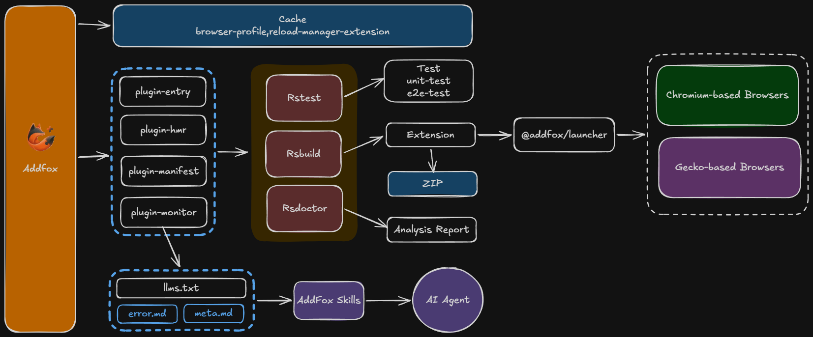

<p align="center">
  
</p>

<h1 align="center">Addfox</h1>

<p align="center">
  <strong>基于 Rstack 的浏览器扩展开发框架。</strong><br>
  极速构建、真正的热更新、强大的浏览器启动——一个项目搞定 Chrome 和 Firefox。
</p>

<div align="center">
  <a href="https://github.com/addfox/addfox/stargazers"></a>
  <a href="https://www.npmjs.com/package/addfox"></a>
  <a href="https://www.npmjs.com/package/addfox"></a>
  <a href="./LICENSE"></a>
</div>
<div align="center">
  <a href="https://addfox.dev">官方文档</a> · <a href="https://www.npmjs.com/package/addfox">npm</a> · <a href="https://github.com/addfox/benchmark">Benchmark</a> · <a href="https://github.com/addfox/skills">Skills</a> · <a href="./README.md">English</a> | 中文
</div>

---

## 为什么选择 Addfox?

- **Rstack 性能** — 基于 [Rsbuild](https://rsbuild.dev)(Rspack):冷启动快、HMR 快、生产构建快。
- **全端真热更新** — background、content script、popup、options…… 全部热重载,无需手动刷新扩展。
- **强大的浏览器启动** — 自动探测并启动 Chromium 系浏览器和 Firefox,内置 profile 与缓存控制。
- **任意 UI 框架** — Vue、React、Preact、Svelte、Solid 或原生,无需包装组件或适配器。
- **一个项目,所有浏览器** — 共享代码库,按浏览器拆分 manifest。

## Benchmark

同一个扩展项目,分别用各框架构建(数值越小越好):

| 框架 | 构建工具 | dev 启动 | 生产构建 | 产物体积 |
| ---- | -------- | -------- | -------- | -------- |
| **Addfox 0.2.9** | **Rsbuild 2.2.1** | **1.56s** | **1.04s** | **837KB** |
| WXT 0.21.4 | Vite 8.1.2 | 1.99s | 1.64s | 810KB |
| Extension.js 4.1.5 | Rspack 2.2.1 | 2.86s | 1.61s | 1.91MB |
| Plasmo 0.90.5 | Parcel 2.9.3 | 2.91s | 2.54s | 1.37MB |

<sub>在相同项目上进行的基准测试,结果可能因项目复杂度而异。测试方法与复现步骤见 [addfox/benchmark](https://github.com/addfox/benchmark)。</sub>

## 与其他方案对比

WXT(Vite)、Plasmo(Parcel)、Extension.js(Rspack)都是优秀的工具。Addfox 走出了自己的路:

| 方案 | 构建工具 | 开发体验 | 灵活性 |
| ---- | -------- | -------- | ------ |
| Plasmo | Parcel | 开箱即用 | 约定式,带云端功能 |
| WXT | Vite | 开箱即用 | 约定式,带插件生态 |
| Extension.js | Rspack | 开箱即用 | 零配置,极简上手 |
| **Addfox** | **Rsbuild** | **开箱即用** | **最少约定,完整 Rsbuild 生态** |

**Addfox 的差异化优势:**

- **Rsbuild 速度** — 同类中最快的 dev 启动与构建(见上方 benchmark)。
- **完整 Rstack 生态** — 内置 Rsdoctor 打包分析与 Rstest 测试。
- **最大自由度** — 不强制文件结构、不引入私有 API,用你习惯的方式写代码。
- **AI 就绪** — 生成 `llms.txt` 元数据,运行时错误直达终端(`--debug`),支持 [skills](https://github.com/addfox/skills) AI 工作流。

## 特性

| | |
| - | - |
| 🔥 **快速开发 + HMR** | 专用重载插件,content script 与 background 均热更新 |
| 🚀 **浏览器启动器** | 自动探测并启动 Chromium / Firefox,profile 与缓存控制,`--keep-browser-profile` |
| 📁 **文件式入口** | 从 `app/` 自动发现入口(background / content / popup / options / sidepanel / devtools) |
| 🌐 **跨浏览器** | Chromium 系 + Firefox,按浏览器拆分 manifest |
| ⚛️ **任意框架** | Vanilla、Vue、React、Preact、Svelte、Solid,TS/JS 均可 |
| 🧩 **Content UI** | 内置 `createContentUI`:Iframe、Shadow DOM、内联注入 |
| 📦 **构建即打包 zip** | `addfox build` 同时输出扩展目录与可上架 zip |
| 🧪 **测试** | `addfox test` 转发到 Rstest,覆盖单测与 e2e |
| 📊 **打包分析** | dev/build 加 `--report` 生成 Rsdoctor 报告 |
| 🔐 **环境变量控制** | 加载 `.env`,通过 `envPrefix` 控制变量暴露范围 |
| 🤖 **AI 就绪** | `llms.txt` 元数据、终端错误输出、skills 集成 |

## 架构

Addfox 基于 Rsbuild 封装扩展专属插件,构建产物直接在 Chrome 或 Firefox 中加载。

<p align="center">
  
</p>

## 快速开始

**新项目:**

```bash
npx addfox@latest create
# 或:pnpm dlx addfox@latest create
# 或:pnpm create addfox-app(旧方式)
```

按提示选择框架、语言、包管理工具和入口,即可生成完整项目与 `addfox.config`。然后:

```bash
cd my-extension
pnpm dev
```

编辑 `app/popup/index.tsx`,保存后扩展会自动重载。

**已有项目:**

```bash
pnpm add -D addfox
```

添加 `addfox.config.ts`,入口放在 `app/`。然后:

- `addfox dev` — 开发模式,watch + 热更新
- `addfox build` — 构建到 `.addfox/extension`(可选打 zip)

使用 `-b chrome` 或 `-b firefox` 指定目标浏览器。

## 示例

[`examples/`](./examples) 目录包含可直接运行的示例项目:React、Vue、Svelte、Solid、content UI、devtools、i18n、环境变量、Firefox 目标等。

## 仓库结构

```
addfox/
├── packages/            # Monorepo 包
│   ├── addfox/          # `addfox` npm 包(CLI 入口)
│   ├── cli/             # @addfox/cli — dev / build / test 命令
│   ├── core/            # @addfox/core — 配置解析与 Rsbuild 流水线
│   ├── launcher/        # @addfox/launcher — 浏览器探测与启动
│   ├── plugins/         # Rsbuild 插件(HMR、manifest、zip 等)
│   └── create-addfox-app/  # 项目脚手架
├── examples/            # 示例扩展(React、Vue、Svelte 等)
├── e2e/                 # Playwright 端到端测试
└── docs/                # 文档站源码(https://addfox.dev)
```

## 参与贡献

欢迎在 [github.com/addfox/addfox](https://github.com/addfox/addfox) 提交 issue 和 PR。报告 bug 时请附复现步骤、期望与实际行为,以及浏览器 / 操作系统信息。

## 支持我们

如果 Addfox 让你的扩展开发更轻松,请在 [GitHub](https://github.com/addfox/addfox/stargazers) 上给我们一个 ⭐ — 这能帮助更多开发者发现这个项目。

## 许可证

[MIT](./LICENSE)

---

**完整文档、配置说明与指南:** [https://addfox.dev](https://addfox.dev)
**Skills(AI 工作流模块):** [https://github.com/addfox/skills](https://github.com/addfox/skills)
